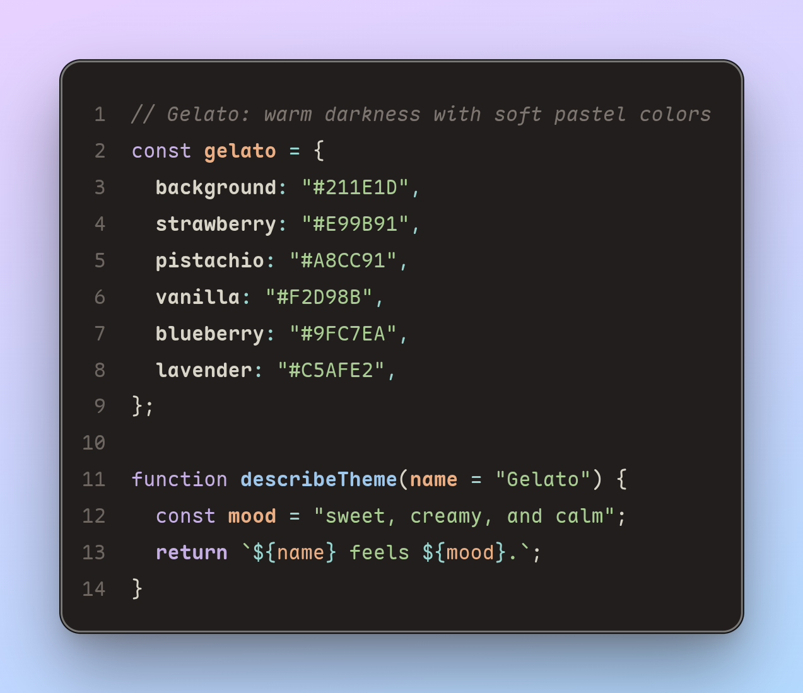
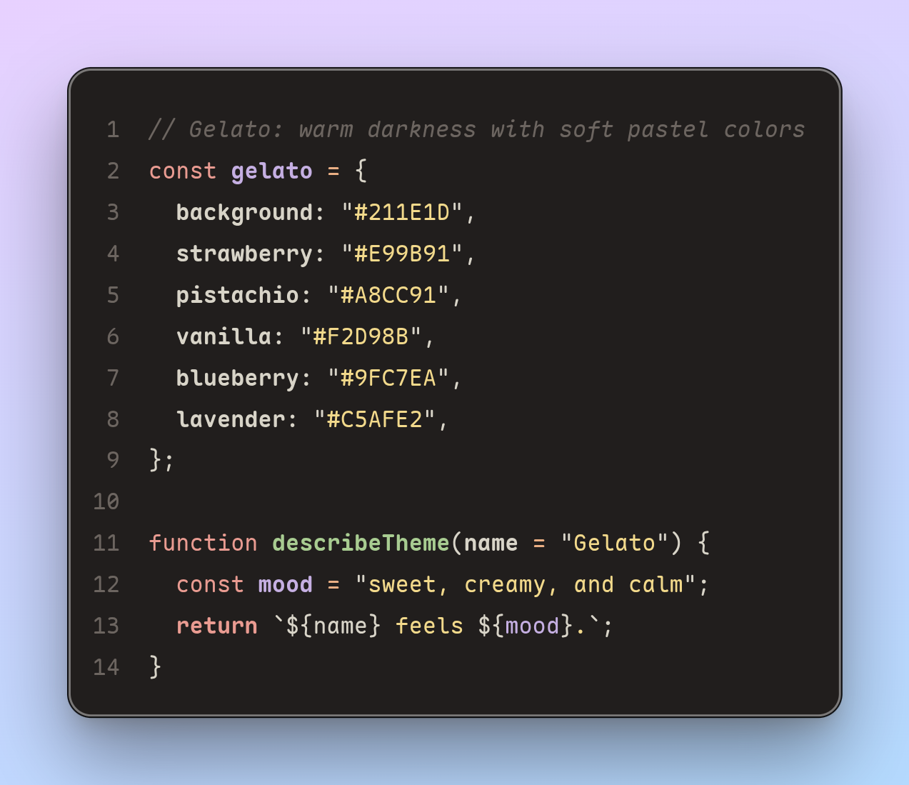

<p align="center">
  
</p>

<h1 align="center">Gelato</h1>

<p align="center">
  A sweet and creamy family of dark themes for Visual Studio Code,<br />
  sprinkled with soft pastel colors.
</p>

## Flavors

Gelato keeps the editor comfortably dark while giving syntax a warm, colorful hierarchy. It ships with three distinct flavors:

- **Gelato Sorbet** — a colorful, expressive theme with clear separation between syntax elements.
- **Gelato Affogato** — a restrained theme with richer contrast and a more focused use of color.
- **Gelato Soft** — a muted, low-contrast take on Affogato with calm, desaturated accents.

All themes include semantic highlighting, complete workbench styling, bracket colors, diagnostics, Git decorations, and Markdown syntax support.

### Gelato Sorbet

Colorful and expressive, with clear separation between syntax elements.



### Gelato Affogato

Restrained and focused, with richer contrast and a selective use of color.



### Gelato Soft

A gentler Affogato variant with subdued neutrals and softly desaturated syntax colors.

## Installation

To try Gelato from source:

1. Clone this repository and open it in Visual Studio Code.
2. Install the development dependency with `npm install`.
3. Press `F5` to open an Extension Development Host.
4. Open the Command Palette and run **Preferences: Color Theme**.
5. Select **Gelato Sorbet**, **Gelato Affogato**, or **Gelato Soft**.

Gelato requires Visual Studio Code 1.59.0 or later.

## Font styles

Gelato lets you control its global syntax emphasis from **Settings → Extensions → Gelato**.

| Setting | Default | Effect |
| --- | --- | --- |
| `gelato.bold` | `true` | Uses bold emphasis for declarations, control flow, headings, and invalid syntax. |
| `gelato.italic` | `false` | Uses italics for comments, language variables, inherited types, and quotes. |

You can also configure the options directly in `settings.json`:

```json
{
  "gelato.bold": true,
  "gelato.italic": false
}
```

The settings apply globally to all Gelato themes and update without requiring a restart.

## Development

All color palettes live in [`palettes`](./palettes): `default.yaml` is shared by Sorbet and Affogato, while `soft.yaml` supplies Gelato Soft's muted colors. Theme-specific token rules live in [`theme-definitions`](./theme-definitions), while the generated VS Code theme files are written to [`themes`](./themes).

```bash
# Generate all theme files
npm run build

# Verify that generated files are up to date
npm run check
```

After changing the palette or a theme definition, run `npm run build` and commit the generated JSON files together with the source changes.

## Contributing

Issues and pull requests are welcome. For color changes, please consider readability across several languages and include a short explanation—or a screenshot—showing the affected syntax.

Made for code that deserves a little sweetness.
